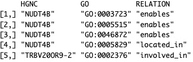
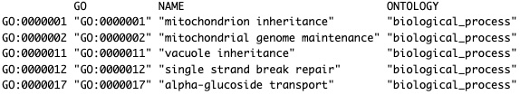
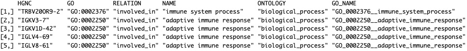
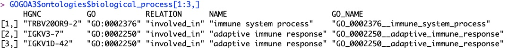
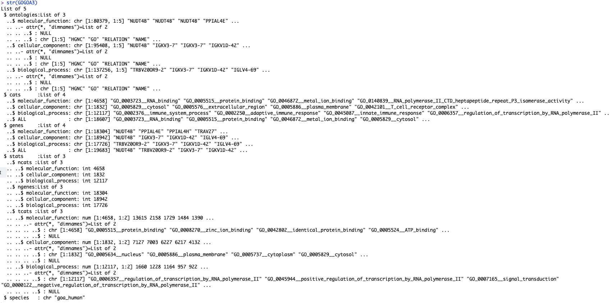
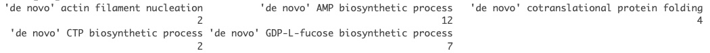

<style>
body {
text-align: justify;
font-size: 16pt;
font-family: Times;}
</style>

<p class=MsoNormal align=center style='text-align:center'><b style='mso-bidi-font-weight:
normal'><span style='font-size:16.0pt;font-family:"Times New Roman",serif;
color:red'>Build a Minimalist Gene Ontology (GO) Database (GODB)<o:p></o:p></span></b></p>

<p class=MsoNormal align=center style='text-align:center'><b style='mso-bidi-font-weight:
normal'><span style='font-size:16.0pt;font-family:"Times New Roman",serif'><o:p>&nbsp;</o:p></span></b></p>

<p class=MsoNormal align=center style='text-align:center'><b style='mso-bidi-font-weight:
normal'><span style='font-size:16.0pt;font-family:"Times New Roman",serif'><o:p>&nbsp;</o:p></span></b></p>

<p class=MsoNormal align=center style='text-align:center'><b style='mso-bidi-font-weight:
normal'><span style='font-size:16.0pt;font-family:"Times New Roman",serif'>Barry
Zeeberg<o:p></o:p></span></b></p>

<p class=MsoNormal align=center style='text-align:center'><b style='mso-bidi-font-weight:
normal'><span style='font-size:16.0pt;font-family:"Times New Roman",serif'>barryz2013@gmail.com<o:p></o:p></span></b></p><br>

<p class=MsoNormal style='text-align:justify'><span style='font-size:16.0pt;
font-family:"Times New Roman",serif'></p><br>

<p class=MsoNormal align=center style='text-align:center'><b style='mso-bidi-font-weight:
normal'><span style='font-size:16.0pt;font-family:"Times New Roman",serif'>NEWS FLASH!!!!<o:p></o:p></span></b></p>

The original version of this package was restricted to human. I have now added about two dozen additional species, namely all species represented on the Gene Ontology download page <https://current.geneontology.org/products/pages/downloads.html>. This covers most of the model organisms that are commonly used in bio-medical and basic research (assuming that anyone still has a grant to do such research). Simply use the downloaded .gaf file for any species as input to buildGODatabase(). The output will be a GOGOA3 database for the species corresponding to the .gaf file.

I decided against constructing a huge single database for all species, in preference to moderate size databases for each species. As is true for the human version, each pre-built species database is available for download from https://github.com/barryzee/GO/tree/main/databases.

To facilitate building so many databases, I now provide buildGODatabaseDriver() which repeatedly invokes buildGODatabase(), looping through all database whose .gaf file is present within the subdirectory passed as an argument.

Two small changes were made in the structure of the database: *GOGOA3\$species* was added to contain the species identifier, and *GOGOA3\$stats\$tcats* was added to contain the output of table() applied to the category names.

GOGOA3 was primarily intended to be used with my 'GoMiner', 'HTGM', and 'HTGM2D' packages. A very slight change (invisible to the user) was made to allow compatibility with the GOGOA3 database for any species, so you will need to re-install the updated versions (*i.e.* 1.10 version) of these 3 packages. There will be a slight delay, since these need to be re-submitted and accepted by CRAN sequentially, but hopefully this delay will only last for a week or so.

I am keeping the original vignette below, but now please consider human as being but a single representative example.


<p class=MsoNormal align=center style='text-align:center'><b style='mso-bidi-font-weight:
normal'><span style='font-size:16.0pt;font-family:"Times New Roman",serif'>Motivation<o:p></o:p></span></b></p>


The Gene Ontology (GO) Consortium (see https://geneontology.org/) maintains and provides a database relating genes and biological processes. This resource has been used extensively to analyze the results of gene expression studies in health and disease.

Building a GO data base (GODB) is fairly complicated, involving downloading multiple database files and using these to build *e.g.* a 'mySQL' database. Accessing this database is also complicated, involving an intimate knowledge of the database in order to construct reliable queries.

Here we have a more modest goal, *GOGOA3* a stripped down version of the GODB that is restricted to human genes as designated by the HUGO Gene Nomenclature Committee (HGNC) (see https://geneontology.org). This can be built in a matter of seconds from 2 easily downloaded files, and it can be queried to determine *e.g.* the mapping of a list of genes to GO categories.

<br>

<p class=MsoNormal align=center style='text-align:center'><b style='mso-bidi-font-weight:
normal'><span style='font-size:16.0pt;font-family:"Times New Roman",serif'>Constructing the GODB<o:p></o:p></span></b></p>

There are two curated files that are publicly available for download, that can be easily processed and then 'joined' to produce the desired minimalist GODB.

goa_human.gaf can be downloaded from https://current.geneontology.org/products/pages/downloads.html and processed by parseGOA() to generate a matrix (Figure1) that relates human gene symbols with the identifier for GO categories. This is not very useful, as we still do not know what these categories are.
<br><br>

{width=50%}

<br>

Fortunately, go-basic.obo can be downloaded from https://geneontology.org/docs/download-ontology/ and processed by parseGOBASIC() to match up the GO identifiers and the category names (Figure 2).

<br>

{width=100%}

<br>

These two matrices can be 'joined' by joinGO() to produce the desired result (Figure 3). The entries in the column 'GO_NAME' are intended to combine the identifier with the descriptive name, eliminating colons and spaces so as to provide a 'safe' name in the event that it might be used as a variable name or a filename in some applications.

{width=125%}

<br>


<p class=MsoNormal align=center style='text-align:center'><b style='mso-bidi-font-weight:
normal'><span style='font-size:16.0pt;font-family:"Times New Roman",serif'>GOGOA3 is a More Convenient Version of GOGOA!<o:p></o:p></span></b></p>

GOGOA contains a column specifying the ontology ("biological_process","molecular_function", or "cellular_component") for each row entry (Figure 3). In practice, queries of GOGOA will target one of these ontologies. Rather than requiring the query to repetitively filter for the desired ontology, the function *subsetGOGOA()* generates the more convenient database GOGOA3, which is essentially a list containing three separate versions of GOGOA, one for each ontology (FIgure 4). GOGOA3 also has several additional components that provide convenient statistical information and metadata that characterize the three ontology databases (Figure 5).

The stats component contains listings of the total number of unique genes (ngenes) and categories (ncats) for each ontology, as well as the more extensive listing of the number of genes and the corresponding fraction of total genes per category (tcats).
<br><br>

{width=100%}
Figure 4. Example of GOGOA3 'biological_process' Ontology
<br><br>

{width=150%}
Figure 5. Components of GOGOA3
<br><br>

GOGOA3.RData and GOGOA.RData are too large to include in a CRAN package, but they can be generated by running the programs in the current package, or by download from https://github.com/barryzee/GO/tree/main/databases. For convenience, GO.RData, GOA.RData, and GODB.RData are provided in the data subdirectory (human only) and at https://github.com/barryzee/GO/tree/main/databases (all species).

<br>


<p class=MsoNormal align=center style='text-align:center'><b style='mso-bidi-font-weight:
normal'><span style='font-size:16.0pt;font-family:"Times New Roman",serif'>Using GOGOA3<o:p></o:p></span></b></p>
                             
GOGOA3 can be queried by a submitted list of genes to determine the distribution of mapping to GO categories (Figure 6).

```
GOGOA3 is a convenient structure representing the minimalist GODB
hgncList is a list of gene identifiers

BP<-GOGOA3$ontologies[["biological_process"]]
w<-which(BP[,"HGNC"] %in% hgcnList)
t<-table(BP[w,"NAME"])
```
<br>
{width=125%}
Figure 6. Mapping of genes to GO categories

<br>

My CRAN package *GoMiner* uses GOGOA3 to implement the GoMiner application first described in my paper *GoMiner: a resource for biological interpretation of genomic and proteomic data* that I had previously published (see Zeeberg, B.R., Feng, W., Wang, G. et al. (2003)<doi:10.1186/gb-2003-4-4-r28>). In the original publication, the user submitted a gene list to a remote server, and waited in a queue for their results to be returned to them. The current GOGOA3 implementation is run on your own local database, just taking a few seconds to obtain your result.